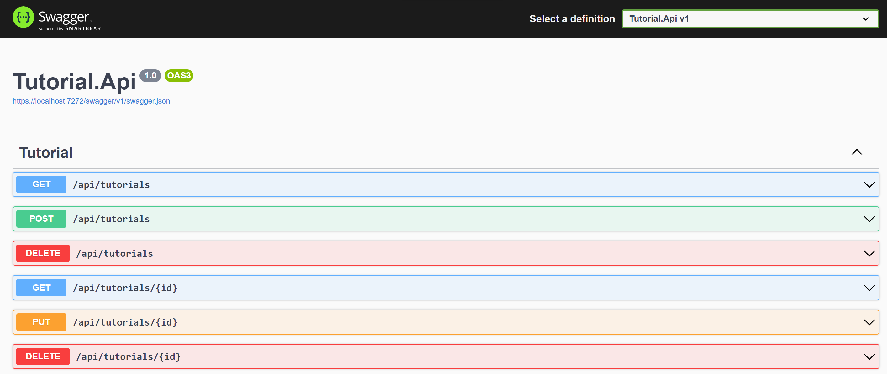

# Dotnet Tutorial Backend API

## ASP.NET

ASP.NET is an open source web framework, created by Microsoft, for building modern web apps and services with .NET. ASP.NET is cross platform and runs on Windows, Linux, macOS, and Docker.

more : https://dotnet.microsoft.com/en-us/learn/aspnet/what-is-aspnet


## Init Project

Create solution project

```ps
dotnet new sln -n Tutorial-Api
```

Create ASP.NET Web Api project

```ps
dotnet new webapi -o Api
```

Create XUnit project

```ps
dotnet new xunit -o Xunit.Tests
```

Add projects to solution

```ps
dotnet sln add .\Tutorial.Api\Tutorial.Api.csproj
dotnet sln add .\XUnit.Tests\XUnit.Tests.csproj
```

Add reference project into xunit project

```ps
dotnet add ./XUnit.Tests/XUnit.Tests.csproj reference .\Tutorial.Api\Tutorial.Api.csproj
```

## Init Database(MongoDB)

Add dependency MongoDB Driver into project

```ps
dotnet add package MongoDB.Driver --version 2.18.0
```

Mongoshell

```sh
Install mongo-shell
https://www.mongodb.com/docs/mongodb-shell/install/

> mongod --dbpath <data_directory_path>

> show dbs

> use tutorialdb

> db.createCollection('tutorials')

> db.tutorials.insertMany([{ "title": "Design Patterns", "description": "", "published": false}])

> db.tutorials.find().pretty()

```

## Run

```ps
dotnet run --project ./Tutorial.Api/
```

Swagger : https://localhost:7272/swagger



https://learn.microsoft.com/en-us/dotnet/core/tools/dotnet-run#examples

- GET /api/tutorials

    Response

    ```json
    [
        {
            "id": "63730beabd3cb05f2331be45",
            "title": "hello",
            "description": "world",
            "published": null,
            "createdAt": "0001-01-01T00:00:00Z",
            "updatedAt": "0001-01-01T00:00:00Z"
        },
        {
            "id": "63732124796b18bc753e9157",
            "title": "dotnet",
            "description": "microsoft",
            "published": null,
            "createdAt": "0001-01-01T00:00:00Z",
            "updatedAt": "0001-01-01T00:00:00Z"
        }
    ]
    ```

- GET /api/tutorials/{id}

    Response

    ```json
    {
        "id": "63730beabd3cb05f2331be45",
        "title": "hello",
        "description": "world",
        "published": null,
        "createdAt": "0001-01-01T00:00:00Z",
        "updatedAt": "0001-01-01T00:00:00Z"
    }
    ```

- POST /api/tutorials

    Request Body

    ```json
    {
        "title": "string",
        "description": "string",
    }
    ```

    Response Body

    ```json
    {
        "code": "200",
        "message": "Inserted a single document Success"
    }
    ```

- DELETE /api/tutorials

    Response Body

    ```json
    {
        "code": "200",
        "message": "All deleted"
    }
    ```

- DELETE /api/tutorials/{id}

    Response Body

    ```json
    {
        "code": "200",
        "message": "Deleted id 63730beabd3cb05f2331be45"
    }
    ```

- PUT /api/tutorials/{id}

    Request Body

    ```json
        {
        "id": "63730beabd3cb05f2331be45",
        "title": "hello",
        "description": "world",
        "published": true
        }
    ```

    Response Body

    ```json
    {
        "code": "200",
        "message": "Deleted id 63730beabd3cb05f2331be45"
    }
    ```

## Build

```ps
dotnet build
```

Restore as distinct layers

```ps
dotnet restore
```

Build and publish a release

```ps
dotnet publish -c Release -o out
```

## Unit Tests

Run Coverage

```ps
dotnet test --collect:"XPlat Code Coverage"
```

Add ReportGenerator nuget

```ps
dotnet add package ReportGenerator --version 5.1.10
```

Setup tool ReportGenerator

```ps
dotnet tool install -g dotnet-reportgenerator-globaltool
```

more : https://www.nuget.org/packages/ReportGenerator

## Run report HTML

```ps
reportgenerator -reports:"XUnit.Tests\TestResults\*\coverage.cobertura.xml" -targetdir:"./coveragereport" -reporttypes:Html
```

## Configurations

Environment variables

|Env Name|Value|
|---|---|
|TutorialDatabase__ConnectionString|mongodb://xxxxxxxx|
|TutorialDatabase__DatabaseName|tutorialdb|
|TutorialDatabase__TutorialCollectionName|tutorials|

## Logging integrate with Azure Application Insights

https://learn.microsoft.com/en-us/azure/azure-monitor/app/ilogger#aspnet-core-applications

Add package ApplicationInsights

```ps
dotnet add package Microsoft.ApplicationInsights.AspNetCore --version 2.21.0
```
